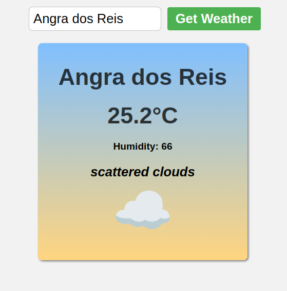

# Weather App

## Overview
Weather App is a modern, intuitive application that provides real-time weather information and forecasts. Designed with user experience in mind, it offers accurate weather data in a clean, easy-to-navigate interface.

## Features
- Current weather conditions
- 5-day forecasts
- Hourly weather updates
- Location-based weather information
- Search functionality for any city worldwide
- Weather alerts and notifications
- Interactive weather maps
- Temperature, precipitation, wind, and humidity data
- Customizable units (metric/imperial)

## Technologies Used
- Frontend: HTML5, CSS3, JavaScript
- Weather API integration
- Responsive design for all devices
- Geolocation services

## Implementation
1. Clone the repository
2. Open `index.js` file
3. Replace `"[PASTE YOUR API KEY HERE]"` with your actual OpenWeatherMap API key.

## Configuration
To use the Weather App, you'll need to obtain an API key from a weather data provider and add it to your configuration file.

## Usage
The app automatically detects your location on startup. You can also search for specific cities using the search bar. View detailed weather information by clicking on the forecast tiles.

## Contributing
Contributions are welcome! Please feel free to submit a Pull Request.

## License
This project is licensed under the MIT License - see the LICENSE file for details.